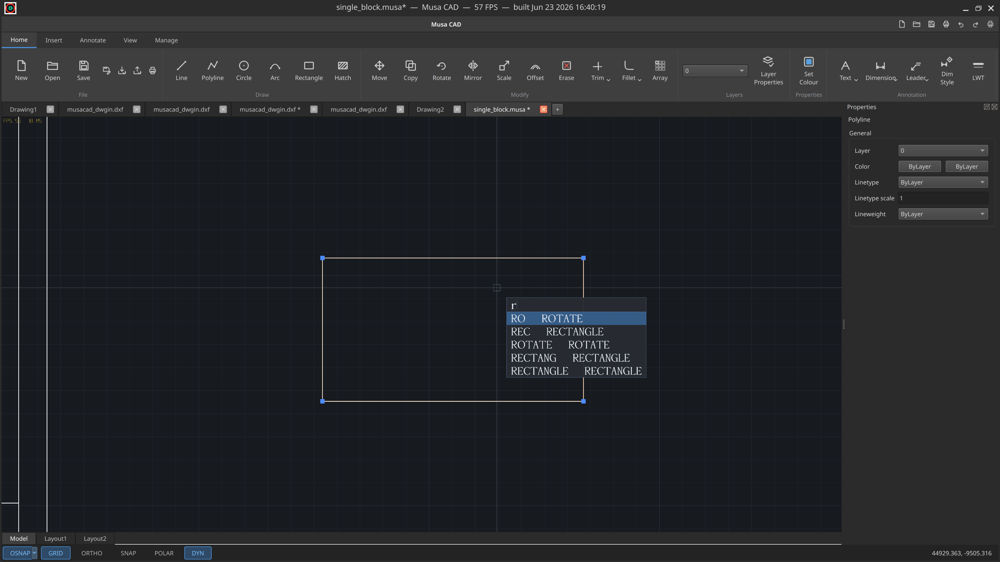
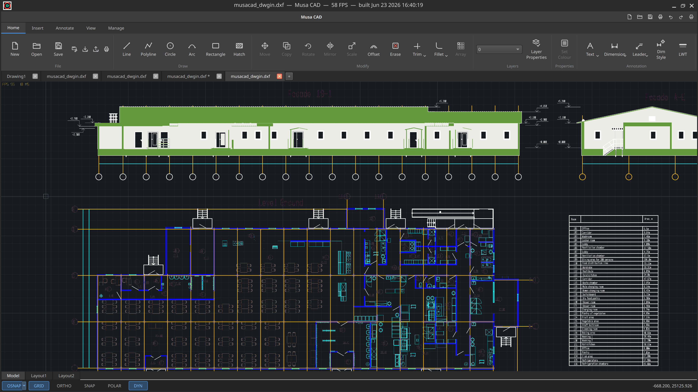
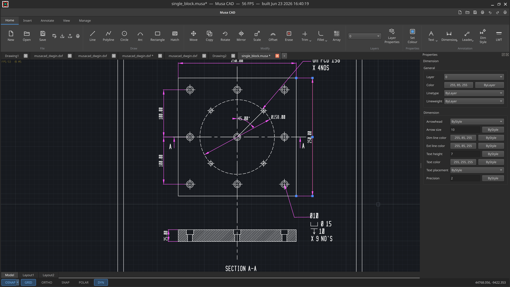
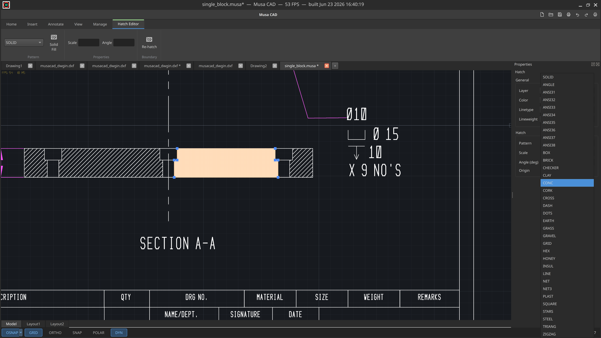

<p align="center">
  
</p>

# Musa CAD

A high-performance, multi-threaded **2D CAD engine** in modern C++23 for Linux
and Windows. Musa CAD mirrors AutoCAD's UI layout, command line, and classic
shortcuts, but runs on a modernized, GPU-accelerated, data-oriented core
targeting a smooth 144 Hz+ viewport.

> Status: actively developed. The 2D engine (Phases 1–5) is complete; 3D B-rep is
> deferred behind a stable kernel interface. See [docs/ARCHITECTURE.md](docs/ARCHITECTURE.md).

---

## Highlights

- **Three-thread architecture** — a UI/command thread, a geometry/compute thread,
  and a render thread that communicate only via a multi-producer command queue
  and a **lock-free triple-buffered snapshot**. No shared mutable state.
- **Data-oriented core** — geometry lives in cache-friendly Structure-of-Arrays
  storage indexed by generational handles (no scattered polymorphic objects, no
  virtual dispatch on hot paths). ~32 ns to insert a line; 1,000,000 lines in
  ~32 ms.
- **Own geometry kernel** — a narrow `IGeometryKernel` interface with a complete
  native 2D backend (`NativeKernel2D`). No third-party CAD/geometry dependency;
  the project is clone-and-build clean.
- **GPU-accelerated viewport** — backend-agnostic RAII GPU abstraction with an
  OpenGL 4.6 (DSA) backend. Instanced rendering draws a **1,000,000-primitive
  scene in ~4–6 draw calls**; pan/zoom upload zero scene bytes and stay smooth
  independent of edit activity (~420–490 FPS measured offscreen on an Intel
  UHD 630 / Mesa).
- **AutoCAD-style command line** — table-driven aliases (`L`, `C`, `PL`, `A`,
  `REC`, `ERASE`, `U`, `ZOOM`), per-command state machines, and
  absolute / relative (`@dx,dy`) / polar (`@dist<angle`) coordinate input with
  history, ENTER-repeat, and ESC-cancel.
- **Snapping & drawing aids** — OSNAP (endpoint, midpoint, center, intersection,
  nearest) computed geometry-side against a shared spatial index and published
  through the snapshot; render-side crosshairs; ortho and polar tracking; grid
  snap; cursor-pick selection.
- **Undo / redo** on the geometry thread, driven by command messages.
- **Classic shortcuts** — `F3` osnap, `F7` grid, `F8` ortho, `F9` snap,
  `F10` polar, `F12` dynamic input, `Ctrl+Z` / `Ctrl+Y`.
- **DXF read/write** built in; **DWG import/export** via an external converter you
  install (ODA File Converter or LibreDWG) — invoked as a subprocess, never linked,
  so Musa CAD stays LGPL-clean. See [docs/BUILD.md](docs/BUILD.md).

---

## Screenshots

<p align="center">
  
  <br><em>AutoCAD-style ribbon, multi-document tabs, dynamic-input command autocomplete, grips, and the Properties palette.</em>
</p>

<p align="center">
  
  
  <br><em>Left: a dense architectural drawing (elevations + floor plan). Right: a dimensioned mechanical detail with a bolt-circle and section view.</em>
</p>

<p align="center">
  
  <br><em>The Hatch Editor contextual tab (pattern library, solid + line hatches) over a sectioned detail and title block.</em>
</p>

---

## Building

Musa CAD is **clone-and-build**:

```sh
cmake --preset dev          # Debug + AddressSanitizer/UBSan + unit tests
cmake --build --preset dev
```

The app lands at `build/dev/bin/musacad_app`. For an optimized build use the
`release` preset. Full prerequisites (a C++23 compiler, CMake 3.25+, Qt6, the
Vulkan loader/headers) and the ThreadSanitizer / CI notes are in
[docs/BUILD.md](docs/BUILD.md).

Run the tests:

```sh
ctest --preset dev
```

---

## Repository layout

```
src/core/      math, generational SoA store, IGeometryKernel + NativeKernel2D,
               threading primitives, snapshots, spatial index, undo/redo
src/render/    backend-agnostic GPU abstraction + OpenGL 4.6 backend, camera,
               grid, viewport renderer
src/command/   table-driven parser, per-command state machines, coordinate input
src/ui/        Qt6 frame, threaded GL viewport, command line, status bar
src/app/       main(), thread orchestration
include/musacad/   public headers mirroring src/
shaders/       GLSL (embedded into the build)
tests/         per-module unit tests + offscreen render & insertion benchmarks
docs/          BUILD.md, ARCHITECTURE.md
assets/        branding (logo/icons), ribbon SVG icons, screenshots
```

---

## Acknowledgements

Musa CAD is authored and maintained by its [contributors](CONTRIBUTORS.md).

Portions of the engine were developed with the assistance of **Anthropic's Claude
(Claude Opus / Claude Code)** as an AI pair-programmer — design discussion,
implementation, and test scaffolding — under human direction and review. All
contributions were reviewed and accepted by the project maintainers, who are
responsible for the final code.

---

## License

Musa CAD is licensed under the **GNU Lesser General Public License, version 3 or
(at your option) any later version (LGPL-3.0-or-later)**. The full texts are in
[`COPYING`](COPYING) (GPL-3.0) and [`COPYING.LESSER`](COPYING.LESSER) (LGPL-3.0);
see [`LICENSE`](LICENSE) for a summary.

In plain terms: you may link Musa CAD into your own software,
**including proprietary software**, as long as you preserve the user's ability to
replace the Musa CAD component with a modified build (the LGPL "relink"
requirement) and keep the license notices. Modifications to **Musa CAD itself**,
if distributed, must remain available under the LGPL-3. Qt6 is linked
dynamically (also LGPL-3); DWG import/export runs through an **external converter
invoked as a separate process** — no DWG library is linked or shipped. Per-file
notices use SPDX identifiers; third-party licenses and the GPL-boundary evidence
are in [`docs/THIRD_PARTY_LICENSES.md`](docs/THIRD_PARTY_LICENSES.md).
