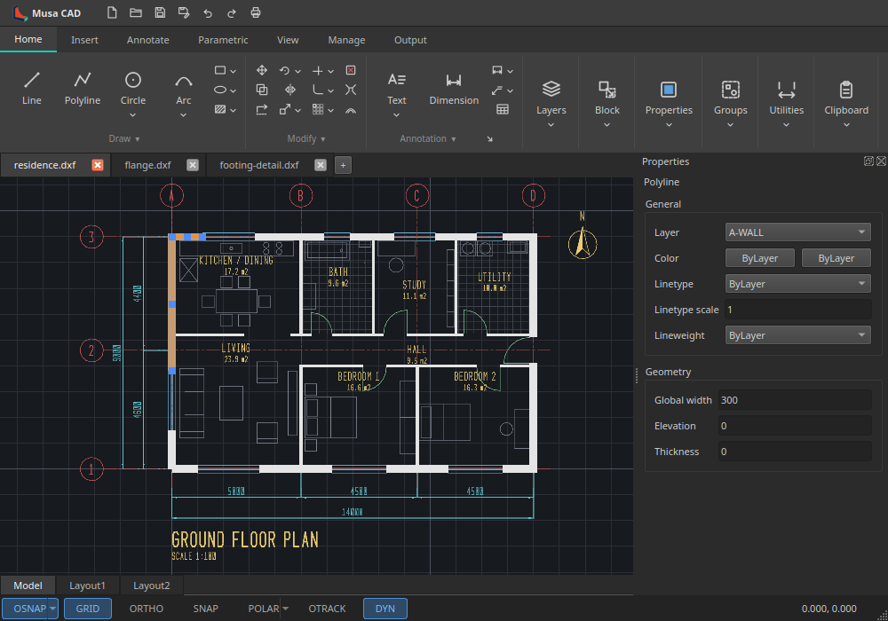
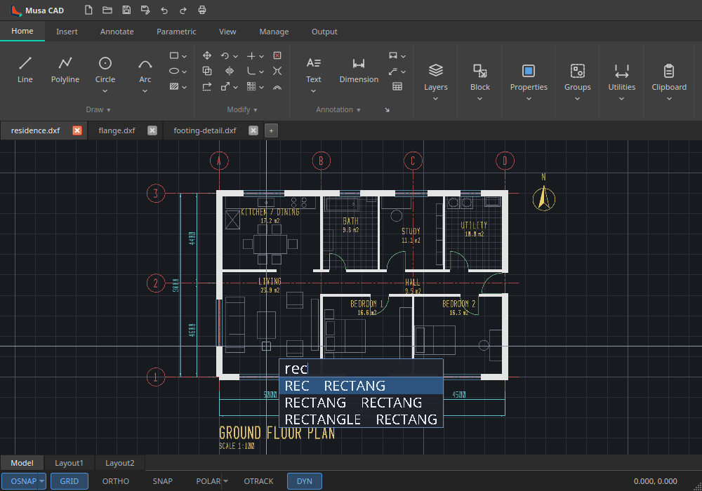
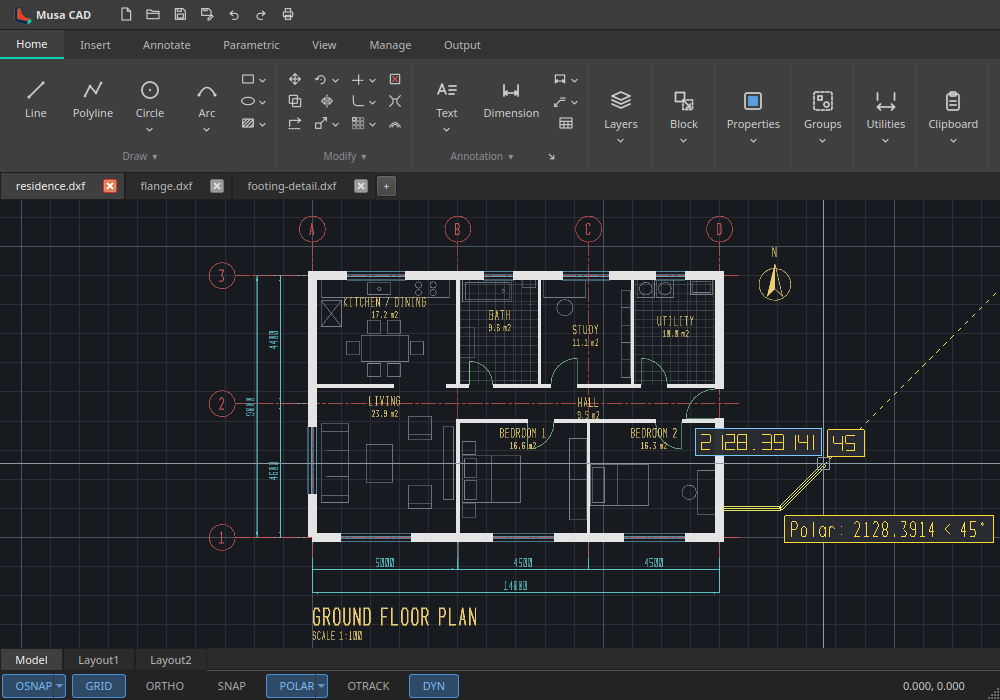
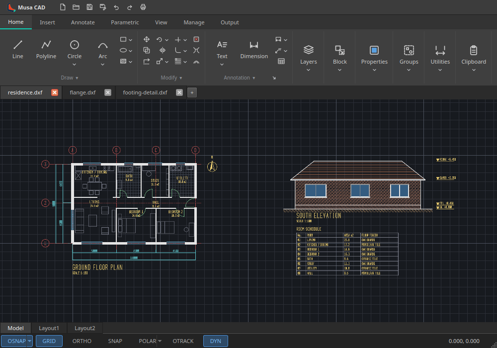
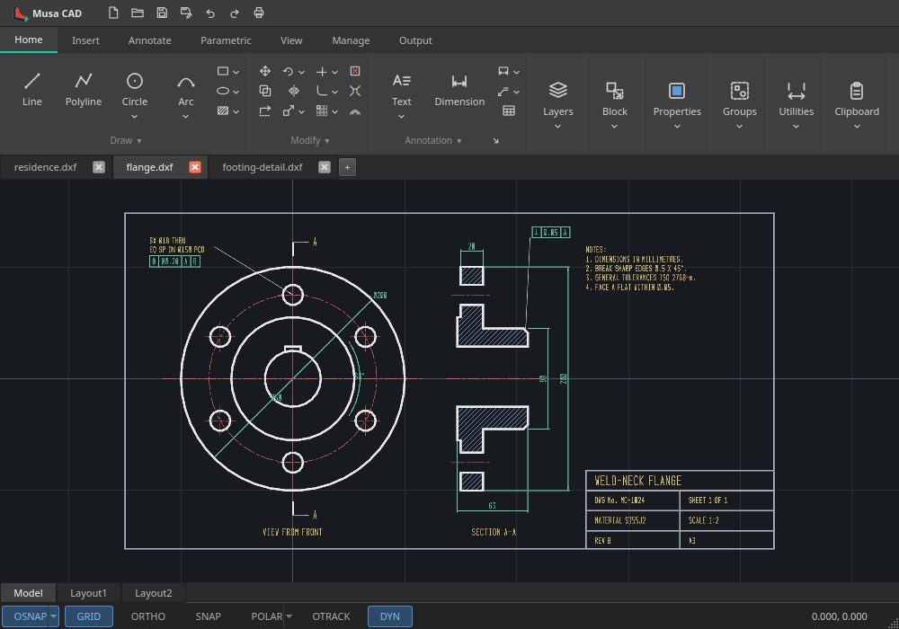
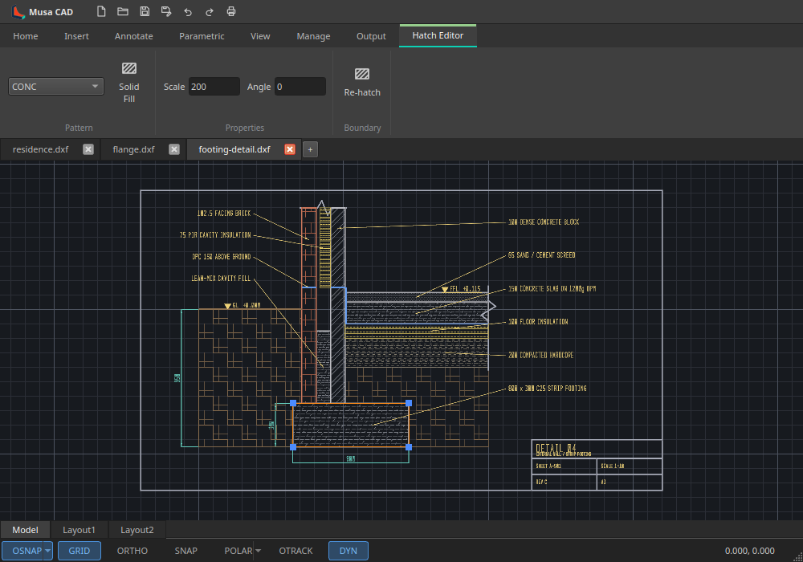

<p align="center">
  
</p>

# Musa CAD

A high-performance, multi-threaded **2D CAD engine** in modern C++23 for Linux
and Windows. Musa CAD mirrors AutoCAD's UI layout, command line, and classic
shortcuts, but runs on a modernized, GPU-accelerated, data-oriented core
targeting a smooth 144 Hz+ viewport.

> Status: actively developed. The 2D engine (Phases 1–5) is complete; 3D B-rep is
> deferred behind a stable kernel interface. See [docs/ARCHITECTURE.md](docs/ARCHITECTURE.md).

---

## Highlights

- **Three-thread architecture** — a UI/command thread, a geometry/compute thread,
  and a render thread that communicate only via a multi-producer command queue
  and a **lock-free triple-buffered snapshot**. No shared mutable state.
- **Data-oriented core** — geometry lives in cache-friendly Structure-of-Arrays
  storage indexed by generational handles (no scattered polymorphic objects, no
  virtual dispatch on hot paths). ~32 ns to insert a line; 1,000,000 lines in
  ~32 ms.
- **Own geometry kernel** — a narrow `IGeometryKernel` interface with a complete
  native 2D backend (`NativeKernel2D`). No third-party CAD/geometry dependency;
  the project is clone-and-build clean.
- **GPU-accelerated viewport** — backend-agnostic RAII GPU abstraction with an
  OpenGL 4.6 (DSA) backend. Instanced rendering draws a **1,000,000-primitive
  scene in ~4–6 draw calls**; pan/zoom upload zero scene bytes and stay smooth
  independent of edit activity (~420–490 FPS measured offscreen on an Intel
  UHD 630 / Mesa).
- **AutoCAD-style command line** — table-driven aliases (`L`, `C`, `PL`, `A`,
  `REC`, `ERASE`, `U`, `ZOOM`), per-command state machines, and
  absolute / relative (`@dx,dy`) / polar (`@dist<angle`) coordinate input with
  history, ENTER-repeat, and ESC-cancel.
- **Snapping & drawing aids** — OSNAP (endpoint, midpoint, center, intersection,
  extension, nearest and the rest of AutoCAD's modes, running or typed for one pick;
  FROM, M2P, TT and TK) computed geometry-side against a shared spatial index and published
  through the snapshot; render-side crosshairs; ortho and polar tracking; grid
  snap; cursor-pick selection.
- **Undo / redo** on the geometry thread, driven by command messages.
- **Classic shortcuts** — `F3` osnap, `F7` grid, `F8` ortho, `F9` snap,
  `F10` polar, `F11` object snap tracking, `F12` dynamic input, `Ctrl+Z` / `Ctrl+Y`.
- **DXF read/write** built in; **DWG import/export** via an external converter (ODA
  File Converter, downloadable from DWG Setup, or LibreDWG) — invoked as a subprocess, never linked,
  so Musa CAD stays LGPL-clean. See [docs/BUILD.md](docs/BUILD.md).

---

## Screenshots

<p align="center">
  
  <br><em>The ribbon, drawing tabs and Properties palette, with a wall of a house plan selected: its grips on the canvas, its layer and width in the palette.</em>
</p>

<p align="center">
  
  
  <br><em>Left: commands typed at the cursor, their matches offered as you type. Right: a wide polyline drawn with its length and angle at the cursor, polar tracking holding it to 45°.</em>
</p>

<p align="center">
  
  
  <br><em>Left: a house plan with its south elevation and room schedule. Right: a dimensioned flange with a section view and geometric tolerances.</em>
</p>

<p align="center">
  
  <br><em>The Hatch Editor on a wall and footing construction detail: brick, block, insulation, concrete, hardcore and earth.</em>
</p>

The drawings in these pictures are made by `tools/screenshots/make_drawings.py`, and
`tools/screenshots/capture.sh` takes the pictures again from a release build.

---

## Building

Musa CAD is **clone-and-build**:

```sh
cmake --preset dev          # Debug + AddressSanitizer/UBSan + unit tests
cmake --build --preset dev
```

The app lands at `build/dev/bin/musacad_app`. For an optimized build use the
`release` preset. Full prerequisites (a C++23 compiler, CMake 3.25+, Qt6, the
Vulkan loader/headers) and the ThreadSanitizer / CI notes are in
[docs/BUILD.md](docs/BUILD.md).

Run the tests:

```sh
ctest --preset dev
```

---

## Command line

The shipped binary is scriptable — open, validate or plot a drawing without a GUI
session:

```sh
musacad drawing.musa                       # open in the GUI
musacad --check drawing.musa               # parse it; exit non-zero on a bad file
musacad --plot drawing.musa out.pdf \      # headless, no display needed
        --paper A4 --portrait --scale 1:5
```

Exit codes are `0` ok, `1` usage, `2` load/parse, `3` output — so it works as a
validator and a batch plotter in CI. `--plot` uses the same loaders, snapshot builder
and plot renderer as `PLOT`/`Ctrl+P` in the GUI. Full grammar in
[docs/CLI.md](docs/CLI.md).

---

## Repository layout

```
src/core/      math, generational SoA store, IGeometryKernel + NativeKernel2D,
               threading primitives, snapshots, spatial index, undo/redo
src/render/    backend-agnostic GPU abstraction + OpenGL 4.6 backend, camera,
               grid, viewport renderer
src/command/   table-driven parser, per-command state machines, coordinate input
src/ui/        Qt6 frame, threaded GL viewport, command line, status bar
src/app/       main(), thread orchestration
include/musacad/   public headers mirroring src/
shaders/       GLSL (embedded into the build)
tests/         per-module unit tests + offscreen render & insertion benchmarks
docs/          BUILD.md, ARCHITECTURE.md, CLI.md, COMMANDS.md, ROADMAP.md
scripts/       release + fixture-plotting helpers
assets/        branding (logo/icons), ribbon SVG icons, screenshots
```

---

## Support the project

Musa CAD is free and open source (LGPL-3.0). If it's useful to you, a donation helps
keep it actively developed and maintained — thank you!

- **Ko-fi:** [ko-fi.com/pranaykiran](https://ko-fi.com/pranaykiran)
- **PayPal:** [paypal.me/pranaykiran](https://paypal.me/pranaykiran)
- **UPI** (India): `kiranpranay12@okicici` &nbsp;·&nbsp; [tap to pay](upi://pay?pa=kiranpranay12@okicici&pn=Pranay%20Kiran&cu=INR)

---

## Acknowledgements

Musa CAD is authored and maintained by its [contributors](CONTRIBUTORS.md).

Portions of the engine were developed with the assistance of **Anthropic's Claude
(Claude Opus / Claude Code)** as an AI pair-programmer — design discussion,
implementation, and test scaffolding — under human direction and review. All
contributions were reviewed and accepted by the project maintainers, who are
responsible for the final code.

---

## License

Musa CAD is licensed under the **GNU Lesser General Public License, version 3 or
(at your option) any later version (LGPL-3.0-or-later)**. The full texts are in
[`COPYING`](COPYING) (GPL-3.0) and [`COPYING.LESSER`](COPYING.LESSER) (LGPL-3.0);
see [`LICENSE`](LICENSE) for a summary.

In plain terms: you may link Musa CAD into your own software,
**including proprietary software**, as long as you preserve the user's ability to
replace the Musa CAD component with a modified build (the LGPL "relink"
requirement) and keep the license notices. Modifications to **Musa CAD itself**,
if distributed, must remain available under the LGPL-3. Qt6 is linked
dynamically (also LGPL-3); DWG import/export runs through an **external converter
invoked as a separate process** — no DWG library is linked or shipped. Per-file
notices use SPDX identifiers; third-party licenses and the GPL-boundary evidence
are in [`docs/THIRD_PARTY_LICENSES.md`](docs/THIRD_PARTY_LICENSES.md).
